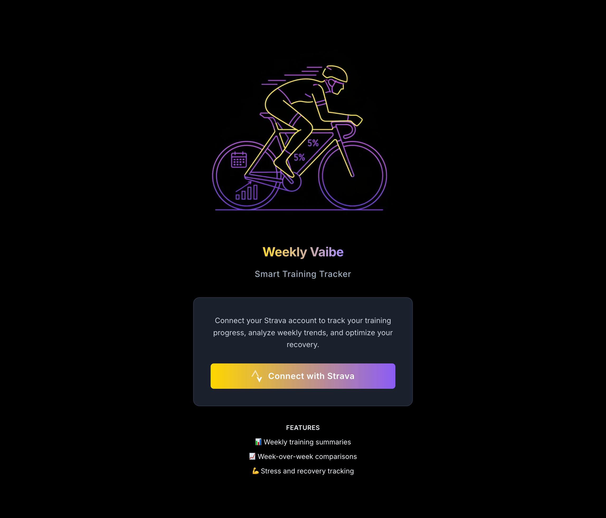
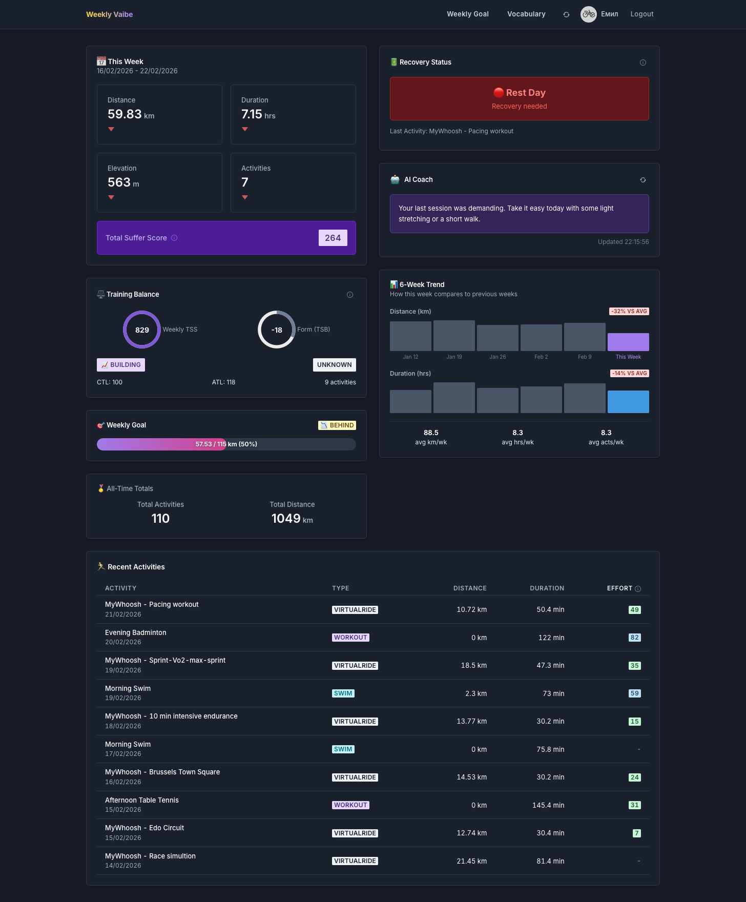
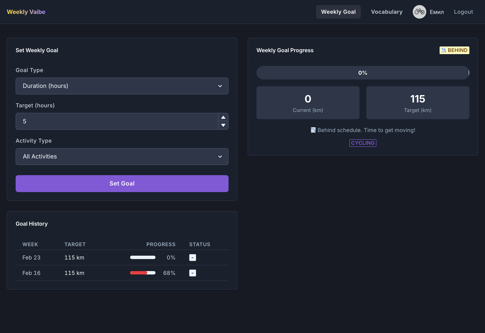
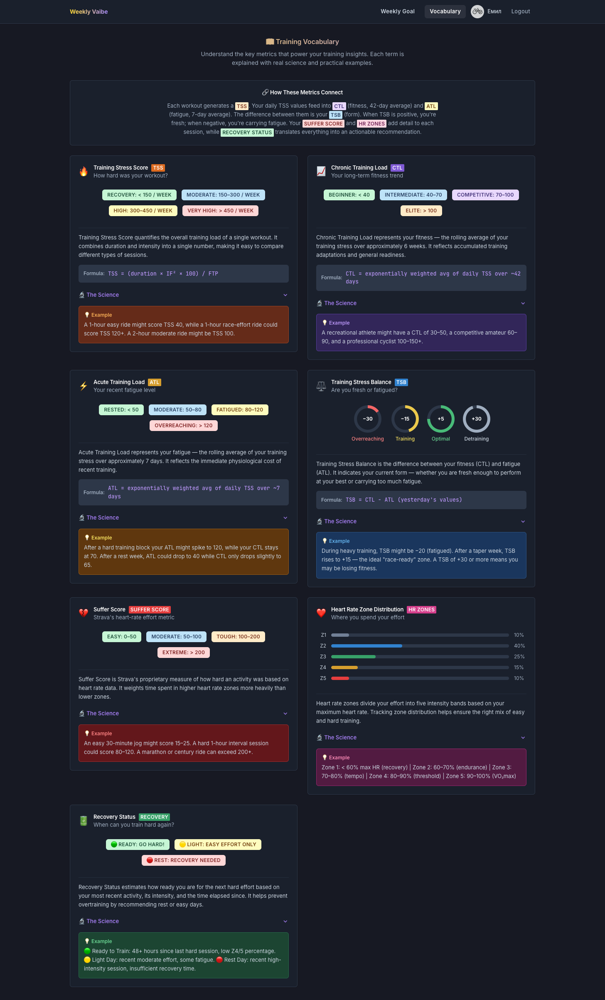

# Weekly Vaibe - Smart Training Tracker

A dashboard for tracking your Strava training progress with weekly summaries, week-over-week comparisons, and activity metrics.

## Tech Stack

- **Frontend**: React + Vite + Chakra UI + TanStack Query
- **Backend**: Node.js + Express + TypeScript
- **Database**: MongoDB
- **Tooling**: Biome (linting/formatting)
- **Deployment**: Docker

## Quick Start

### Prerequisites

- Node.js 20+
- MongoDB (local or Atlas)
- Strava API application ([Create one here](https://www.strava.com/settings/api))

### Development Setup

1. **Clone and install dependencies**

```bash
cd weeklyvaibe
npm install
```

2. **Configure environment**

```bash
cp .env.example .env
```

Edit `.env` with your Strava API credentials:

```env
STRAVA_CLIENT_ID=your_client_id
STRAVA_CLIENT_SECRET=your_client_secret
STRAVA_REDIRECT_URI=http://localhost:3001/auth/callback
MONGODB_URI=mongodb://localhost:27017/weeklyvaibe
SESSION_SECRET=your_random_secret
```

3. **Start MongoDB** (if not using Atlas)

```bash
# Using Docker
docker run -d -p 27017:27017 --name mongodb mongo:7

# Or using brew (macOS)
brew services start mongodb-community
```

4. **Run development servers**

```bash
npm run dev
```

This starts:
- Server: http://localhost:3001
- Client: http://localhost:5173

5. **Open the app**

Navigate to http://localhost:5173 and click "Connect with Strava" to authenticate.

## Docker Deployment

1. **Build and run with Docker Compose**

```bash
docker-compose up --build
```

2. **Access the app**

Navigate to http://localhost (port 80)

## Project Structure

```
weeklyvaibe/
├── client/                 # React frontend
│   ├── src/
│   │   ├── lib/api.ts     # TanStack Query hooks
│   │   ├── pages/         # Login, Dashboard
│   │   └── main.tsx       # App entry
│   └── Dockerfile
├── server/                 # Node.js backend
│   ├── src/
│   │   ├── auth/          # Strava OAuth
│   │   ├── models/        # MongoDB schemas
│   │   ├── routes/        # API endpoints
│   │   ├── services/      # Business logic
│   │   └── index.ts       # Server entry
│   └── Dockerfile
├── docker-compose.yml
├── biome.json             # Linting/formatting config
└── package.json           # Workspace config
```

## API Endpoints

- `GET /auth/strava` - Redirect to Strava OAuth
- `GET /auth/callback` - OAuth callback handler
- `GET /auth/me` - Get current user
- `POST /auth/logout` - Logout
- `GET /api/dashboard` - Weekly summary + recent activities
- `GET /api/activities` - Paginated activities list
- `POST /api/sync` - Trigger manual Strava sync

## License

MIT

## Screenshots

### Login



### Dashboard



### Weekly Goal



### Vocabulary


